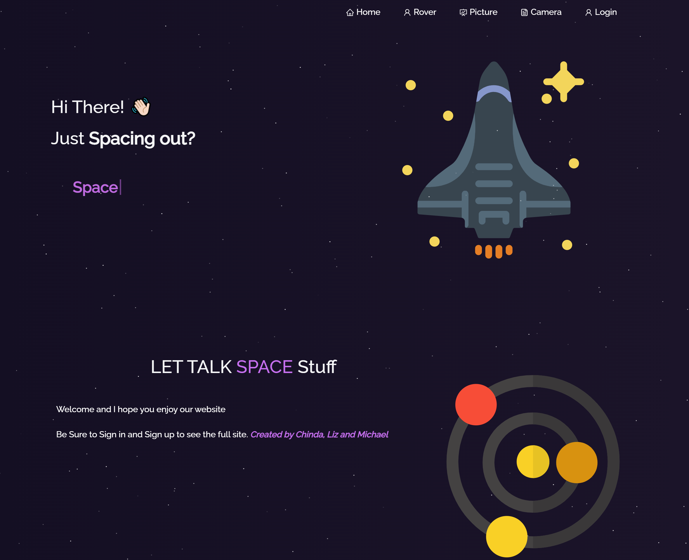
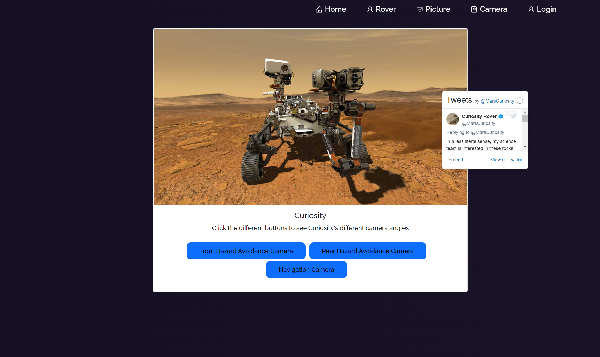

# I-Need-Space

## Description
Some features of this application.
1. Our rover page gives you three different Rover camera angles and Curiosity's Twitter feed.
2. Our picture of the day shows you a new photo of space each day powered by NASA and allows you to comment in our discussion section. 
3. On our camera page you can take a picture with your favorite rover. 

---

## Table of content

* [Description](#description)

* [Usage](#usage)

* [How to Contribute](#how-to-contribute)

* [Links](#links)

* [Technologies](#technologies)

* [Pictures](#pictures)

---

## Usage

Because sometimes in life...You just need some space.

## How to Contribute

Pull requests. Feel free to open a pull requst on my GitHub.

## Technologies

Technologies used in this project:

* Node.js and Express.js 
* Axios
* Bootstrap
* JWT authentication 
* MongoDB and the Mongoose
* React
* Twitter Embed
* Graphql
* Downloadjs
* Use React Screenshot
* MUI

----

## Links

[GitHub Repo](https://github.com/elizabethdberube/I-Need-Space) 

[Deployed Application](https://ijustneedsomespace.herokuapp.com/) 

----

## Pictures

